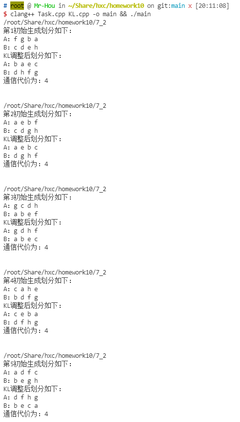
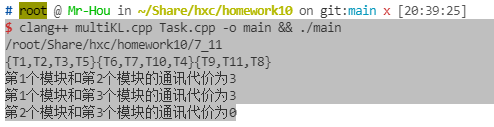

## 7.2 编程实现KL算法

##### 对于任务以及任务间通信矩阵的获取，沿用之前的`Task.cpp`代码

```c++
//根据算法的定义计算每个任务对应的D值
void caculateD(vector<bool>&           curTask,
               int                     index,
               vector<double>&         D,
               vector<int>&            moduleA,
               vector<int>&            moduleB,
               vector<vector<double>>& commCostMatrix)
{
    if (!curTask[index])
        return;
    auto it = find(moduleA.begin(), moduleA.end(), index);

    if (it != moduleA.end())
    {
        double E = 0, I = 0;
        for (auto ait = moduleA.begin(); ait != moduleA.end(); ait++)
        {
            if (curTask[*ait])
                I += commCostMatrix[index][*ait];
        }
        for (auto bit = moduleB.begin(); bit != moduleB.end(); bit++)
        {
            if (curTask[*bit])
                E += commCostMatrix[index][*bit];
        }
        D[index] = E - I;
    }
    else
    {

        double E = 0, I = 0;
        for (auto ait = moduleA.begin(); ait != moduleA.end(); ait++)
        {
            if (curTask[*ait])
                E += commCostMatrix[index][*ait];
        }
        for (auto bit = moduleB.begin(); bit != moduleB.end(); bit++)
        {
            if (curTask[*bit])
                I += commCostMatrix[index][*bit];
        }
        D[index] = E - I;
    }
    return;
}

//获取精选收益下标a值与b值以及对应的gain值
pair<pair<int, int>, double> selectedElement(vector<bool>&           curTask,
                                             vector<double>&         D,
                                             vector<int>&            moduleA,
                                             vector<int>&            moduleB,
                                             vector<vector<double>>& commCostMatrix)
{
    int    ai, bi;
    double gain = -1000000.0;

    for (auto ait = moduleA.begin(); ait != moduleA.end(); ait++)
    {
        for (auto bit = moduleB.begin(); bit != moduleB.end(); bit++)
        {
            if (curTask[*ait] && curTask[*bit])
            {
                if (D[*ait] + D[*bit] - 2 * commCostMatrix[*ait][*bit] > gain)
                {
                    ai   = *ait;
                    bi   = *bit;
                    gain = D[*ait] + D[*bit] - 2 * commCostMatrix[*ait][*bit];
                }
            }
        }
    }
    return pair<pair<int, int>, double>{{ai, bi}, gain};
}

//KL算法的核心代码
void KL(int                     taskNum,
        vector<double>&         D,
        vector<int>&            moduleA,
        vector<int>&            moduleB,
        vector<vector<double>>& commCostMatrix)
{
    vector<pair<pair<int, int>, double>> rst;
    vector<bool>                         curTask(taskNum, true);
    for (int i = 0; i < taskNum; i++)
    {
        caculateD(curTask, i, D, moduleA, moduleB, commCostMatrix);
    }

    int p = 1;
    while (p != taskNum / 2 + 1)
    {
        pair<pair<int, int>, double> selected = selectedElement(curTask, D, moduleA, moduleB, commCostMatrix);
        rst.push_back(selected);
        curTask[selected.first.first]  = false;
        curTask[selected.first.second] = false;
        for (int i = 0; i < taskNum; i++)
        {
            caculateD(curTask, i, D, moduleA, moduleB, commCostMatrix);
        }
        p++;
    }
    int    k   = 0;
    double G   = 0;
    double max = 1.0 * (INT32_MIN);
    for (int i = 0; i < taskNum / 2; i++)
    {
        // cout << "gain" << rst[i].second << " ";
        G += rst[i].second;
        if (G > max)
        {
            max = G;
            k   = i;
        }
    }

    G = 0;
    for (int i = 0; i <= k; i++)
        G += rst[i].second;

    if (G > 0)
    {
        for (int i = 0; i <= k; i++)
        {
            int temp = rst[i].first.first;
            moduleA.erase(remove(moduleA.begin(), moduleA.end(), temp));
            moduleB.push_back(temp);

            temp = rst[i].first.second;
            moduleB.erase(remove(moduleB.begin(), moduleB.end(), temp));
            moduleA.push_back(temp);
        }
        KL(taskNum, D, moduleA, moduleB, commCostMatrix);
    }
    else
    {
        for (auto ait = moduleA.begin(); ait != moduleA.end(); ait++)
        {
            cout << *ait << " ";
        }
        cout << endl;
        for (auto bit = moduleB.begin(); bit != moduleB.end(); bit++)
        {
            cout << *bit << " ";
        }
        cout << endl;
        return;
    }
}
```

### 随机生成不同模块A、B

```c++
//函数随机生成不同的模块A与模块B
void randSelect(vector<int>& moduleA, vector<int>& moduleB, int taskNum)
{
    int arr[taskNum];
    for (int i = 0; i < taskNum; i++)
        arr[i] = 1; 
    sleep(1);
    srand((unsigned)time(NULL)); 
    cout << time(0) << endl;
    int index = 0;
    while (index < taskNum / 2)
    {
        int t = rand() % taskNum;
        if (arr[t] != 0)
        {
            moduleA.push_back(t);
            arr[t] = 0;
            index++;
        }
    }

    for (int i = 0; i < taskNum; i++)
    {
        if (arr[i] != 0)
        {
            moduleB.push_back(i);
        }
    }

    return;
}
```

### 结果展示，随机5次结果




## 7.3 编程实现KL多式划分算法

##### 根据多式划分定义，向模块中添加补充`0`元素

```c++
void setZero(int                     maxTask,
             int                     i,
             int                     tasksNum,
             vector<string>&         tasks,
             vector<vector<double>>& commCostMatrix,
             vector<int>&            nodes,
             int                     fn)
{
    for (int j = tasksNum; j < fn; j++)
    {
        tasks.push_back(" ");
    }
    for (int j = 0; j < tasksNum; j++)
    {
        for (int k = tasksNum; k < fn; k++)
        {
            commCostMatrix[j].push_back(0);
        }
    }
    for (int j = tasksNum; j < fn; j++)
    {
        commCostMatrix.push_back(vector<double>(fn, 0));
    }
    for (int j = 0; j < fn; j++)
    {
        nodes.push_back(j);
    }
}
```

##### 根据多式划分KL算法计算需要二式划分次数

```c++
void KLToExpon(int oriTaskNum, int n, vector<string> d, vector<vector<double>> a, vector<int> nodes, int k)
{
    if (k == 0)
    {
        ret.push_back(nodes);
        return;
    }
    Task kl(oriTaskNum, n, d, nodes, a);
    kl.Binary();
    k--;
    KLToExpon(oriTaskNum, n >> 1, d, a, kl.getA(), k);
    KLToExpon(oriTaskNum, n >> 1, d, a, kl.getB(), k);
}
```

##### Note：由于KL算法划分后，添加的`0`元素都会由于KL算法的定义属性(外部通信代价越小越好，内部通信代价越大越好)都会聚集在单独的一个模块中，故删去最终划分后的模块中的`0`元素即可


##### 输出结果

```c++
for (int j = 0; j < ret.size(); j++)
{
    cout << "{";
    for (auto x : ret[j])
    {
        cout << tasks[x];
        if (x != *(ret[j].end() - 1))
            cout << ",";
    }
    cout << "}";
}
cout << endl;

for (int j = 0; j < ret.size(); j++)
{
    for (int k = j + 1; k < ret.size(); k++)
    {
        cout << "第" << j + 1 << "个模块和"
            << "第" << k + 1 << "个模块的通讯代价为";
        int sum = 0;
        for (auto x : ret[j])
        {
            for (auto y : ret[k])
            {
                sum += commCostMatrix[x][y];
            }
        }
        cout << sum << endl;
    }
}
```



