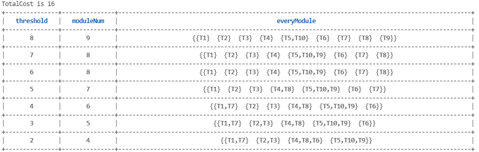

## 7.1 编程实现多模块化划分算法MMM（单链接、全链接、均链接）

- Task结构体定义以及获取函数等内容均在之前作业版本上修改，详见`Task.h`与`Task.cpp`
- 期望划分模块数、模块内最大任务数，划分链接算法等参数的获取使用github上工具`cmdline.cpp`实现


- `agglomerative`为主要的模块划分函数，其中的mode代表了使用的划分算法是哪种

```c++
void agglomerative(int                  mode,
                   vector<string>&      tasks,
                   vector<vector<int>>& commCostMatrix,
                   int                  moduleNum,
                   int                  maxTaskNumInClu,
                   map<string, int>&    tasksToIndex)
{
    int thold = getMaxCommCost(commCostMatrix);

    // return ;
    int tempModNum = tasks.size();
    // modObj就是任务属于哪些模块的具体划分；
    vector<vector<string>> modObj  = initModObj(tasks, vector<vector<string>>{});
    dendrogram             de      = dendrogram{thold, tempModNum, modObj};
    dendrogram             firstDe = dendrogram{thold, tempModNum, modObj};
    vector<dendrogram>     deList  = {firstDe};
    while (thold != 0 && tempModNum != moduleNum)
    {
        for (auto formerIt = de.modObj.begin(); formerIt != de.modObj.end(); formerIt++)
        {
            auto laterIt = formerIt + 1;
            while (laterIt != de.modObj.end())
            {
                bool isMerge;
                switch (mode)
                {
                    case 1:
                        isMerge = singleAgglomerative(formerIt, laterIt, tasksToIndex, commCostMatrix, thold);
                        break;
                    case 2:
                        isMerge = completeAgglomerative(formerIt, laterIt, tasksToIndex, commCostMatrix, thold);
                        break;
                    case 3:
                        isMerge = averageAgglomerative(formerIt, laterIt, tasksToIndex, commCostMatrix, thold);
                        break;
                    default:
                        break;
                }
                if (isMerge && formerIt->size() + laterIt->size() <= maxTaskNumInClu)
                {
                    for (auto it = laterIt->begin(); it != laterIt->end(); it++)
                    {
                        formerIt->push_back(*it);
                    }
                    de.modObj.erase(laterIt);
                    // laterIt++;
                }
                else
                    laterIt++;
            }
        }
        tempModNum = de.modObj.size();
        deList.push_back({thold - 1, tempModNum, de.modObj});
        runTimeOutPut(thold, tempModNum, de.modObj);
        thold--;
        if (thold < -1)
            return;
        // cout << "thold " << thold << endl;
    }
    if (thold == 0 && tempModNum > moduleNum)
    {
        singleAgglomerativeK1(commCostMatrix, de.modObj, tasksToIndex, moduleNum, maxTaskNumInClu);
    }
    finOutPut(de.modObj, commCostMatrix, tasksToIndex);
}
```

- 单链接

```c++
bool singleAgglomerative(vector<vector<string>>::iterator formerIt,
                         vector<vector<string>>::iterator laterIt,
                         map<string, int>&                tasksToIndex,
                         vector<vector<int>>&             commCostMatrix,
                         int                              thold)
{
    for (int i = 0; i < formerIt->size(); i++)
    {
        for (int j = 0; j < laterIt->size(); j++)
        {
            // string str = (*formerIt)[i];
            if (commCostMatrix[tasksToIndex[(*formerIt)[i]]][tasksToIndex[(*laterIt)[j]]] >= thold)
                return true;
        }
    }
    return false;
}
```

- 全链接

```c++
bool completeAgglomerative(vector<vector<string>>::iterator formerIt,
                           vector<vector<string>>::iterator laterIt,
                           map<string, int>&                tasksToIndex,
                           vector<vector<int>>&             commCostMatrix,
                           int                              thold)
{
    for (int i = 0; i < formerIt->size(); i++)
    {
        for (int j = 0; j < laterIt->size(); j++)
        {
            // string str = (*formerIt)[i];
            if (commCostMatrix[tasksToIndex[(*formerIt)[i]]][tasksToIndex[(*laterIt)[j]]] < thold)
                return false;
        }
    }
    return true;
}
```


- 均链接

```c++
bool averageAgglomerative(vector<vector<string>>::iterator formerIt,
                          vector<vector<string>>::iterator laterIt,
                          map<string, int>&                tasksToIndex,
                          vector<vector<int>>&             commCostMatrix,
                          int                              thold)
{
    int sum = 0;
    for (int i = 0; i < formerIt->size(); i++)
    {
        for (int j = 0; j < laterIt->size(); j++)
        {
            sum += commCostMatrix[tasksToIndex[(*formerIt)[i]]][tasksToIndex[(*laterIt)[j]]];
        }
    }
    if (sum / (formerIt->size() * laterIt->size()) >= thold)
        return true;
    return false;
}
```

- `singleAgglomerativeK1`函数用于全链接或者均链接划分时，无法得到期望的解，使用阈值为1的单链接算法再次进行划分

```c++
void singleAgglomerativeK1(const vector<vector<int>>&    commCostMatrix,
                           vector<vector<string>>& modObj,
                           map<string, int>&             tasksToIndex,
                           int                           moduleNum,
                           int                           maxTaskNumInClu)
{
    int k1CommNum = modObj.size();
    cout << "k1NUm " << k1CommNum << endl;
    vector<vector<int>> k1CommCostMatrix;
    for (auto ait = modObj.begin(); ait != modObj.end(); ait++)
    {
        vector<int> tempCommCost;
        for (auto bit = modObj.begin(); bit != modObj.end(); bit++)
        {
            int sum = 0;
            for (auto mit = ait->begin(); mit != ait->end(); mit++)
            {
                for (auto nit = bit->begin(); nit != bit->end(); nit++)
                {
                    sum += commCostMatrix[tasksToIndex[*mit]][tasksToIndex[*nit]];
                }
            }
            if (ait == bit)
                sum = 0;
            tempCommCost.push_back(sum);
        }
        k1CommCostMatrix.push_back(tempCommCost);
    }

    map<string, int> k1TasksToIndex;

    makeMap(k1TasksToIndex, vector<string>{}, modObj);

    k1Agglomerative(modObj, k1CommCostMatrix, moduleNum, maxTaskNumInClu, k1TasksToIndex);
}
```

##### (1)输出结果

- 单链接

  

- 全链接

  

- 均链接

  

##### (2)输出结果

- 单链接


- 全链接


- 均链接

  

  均链接貌似存在问题，最后会进入阈值为0，但是模块数还是超过期望的模块数。

